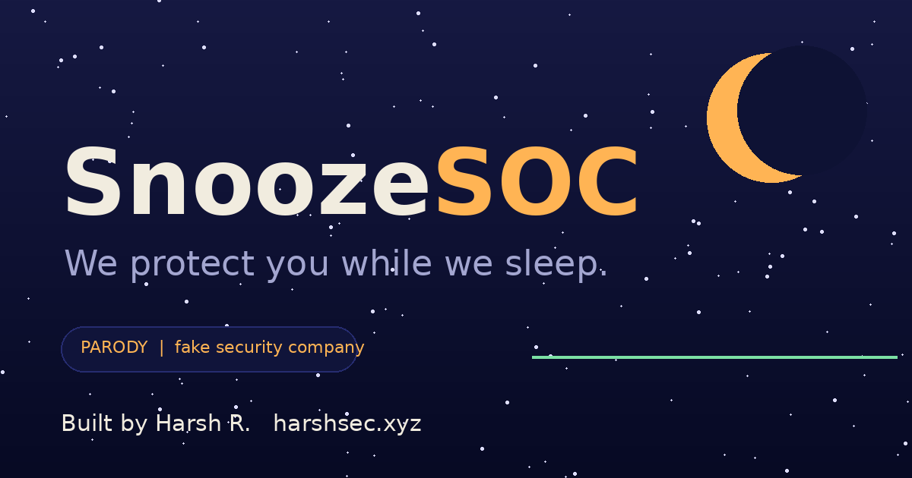

<div align="center">

# 😴 SnoozeSOC

### *We protect you while we sleep.*

A parody cybersecurity company where one very tired analyst is your entire Security Operations Center.

**[🌐 Live demo → harshsec.xyz](https://harshsec.xyz)**




</div>

---

## What is this?

Real Security Operations Centers (SOCs) watch for attacks 24/7. **SnoozeSOC** watches whenever its analyst wakes up. It is a satire of over-hyped security marketing: buzzwords, "AI-powered" everything, and dashboards that look impressive but say nothing.

> ⚠️ **This is a parody project.** No security service is provided, no data is collected, and it is not affiliated with any real vendor. Please do not enter real data into it.

## Features

- 📉 **Live "dashboard"** with a flatline attack graph, a draining coffee meter and a fake log feed
- 🚨 **Attack simulator**: the screen goes red, alarms flash, the analyst sleeps through it
- 😴 **Interactive sleepy analyst** (SVG illustration): click him to wake him up
- 🔍 **Fake network scan** that finds "Wi-Fi named FBI Van 3"
- 🌌 **Canvas starry sky** with shooting stars, cursor glow, 3D dashboard tilt and scroll reveals
- 🧠 **Buzzword translator**: each fake feature shows what the real thing actually does
- 🍪 **Cookie banner** where both buttons say "Accept"

## Tech

Zero dependencies. One `index.html` with plain HTML, CSS and vanilla JavaScript (Canvas API for the sky and the chart). Fonts: Bricolage Grotesque and JetBrains Mono via Google Fonts.

## Run locally

```bash
git clone https://github.com/rootharsh/snoozesoc.git
cd snoozesoc
# just open index.html in a browser, or:
npx serve .
```

## Deploy

Import the repo into [Vercel](https://vercel.com/new), set the framework preset to **Other** (no build command), and deploy. Every `git push` redeploys automatically.

## Author

**Harsh R.** is a cybersecurity student, web developer and guitarist.

- 🌐 Portfolio: [harshsec.in](https://harshsec.in)
- 💻 GitHub: [@rootharsh](https://github.com/rootharsh)
- 📸 Instagram: [@harsh.sec](https://instagram.com/harsh.sec)

---

<div align="center"><sub>© 2026 SnoozeSOC (not a real company) · Designed and built by Harsh R.</sub></div>
